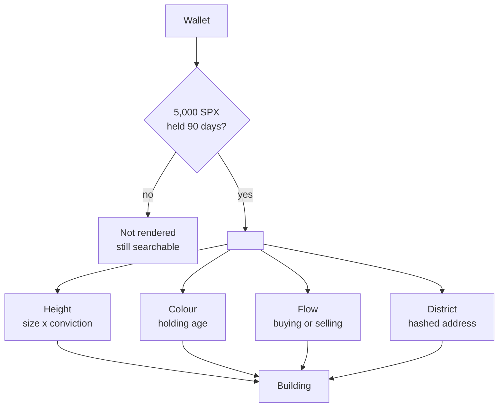

# Whale City

**Whale City turns blockchain data into a city.**

Every building represents a single wallet.

The taller the building, the larger and longer-held the position. The colour reflects holding age.
Green and red beams show who is accumulating and who is distributing. Even the harbour has meaning:
exchanges, liquidity pools, bridges and burned tokens become physical landmarks instead of
disappearing into tables.

## Nothing is decorative

Every visible feature corresponds to a measurable property of the blockchain. If something exists
only to make the city look better, it is labelled as a game or it does not exist.

Whale City and Aeon City use exactly the same rendering engine. The only difference is the
underlying dataset: fungible token balances for Whale City, NFT ownership for [Aeon City](aeon-city.md).

## How a wallet becomes a building

## Start here

| If you want to know… | Read |
| --- | --- |
| What a single building is telling you | [Reading a Building](reading-a-building/README.md) |
| Why the skyline is shaped the way it is | [Height](reading-a-building/height.md) |
| Who is buying and who is selling | [Flow](reading-a-building/flow.md) |
| What the statue, the bridge and the docks mean | [Infrastructure](infrastructure.md) |
| What the city gets wrong, or can't say | [Limitations](limitations.md) |
| The rules the whole thing is built on | [Design Principles](design-principles.md) |

***

Figures throughout are from the live data on **29 July 2026**. Everything is reproducible — see
[Technical Details](technical-details.md).
